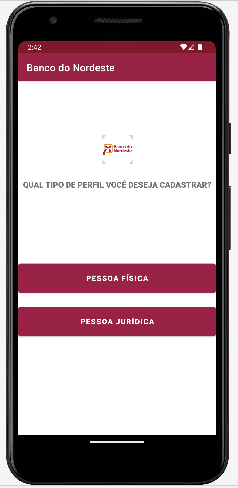
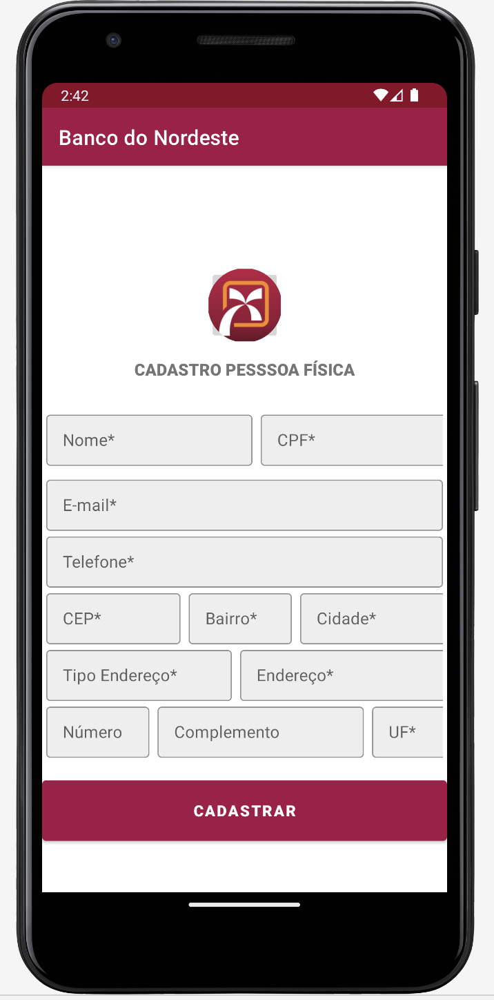
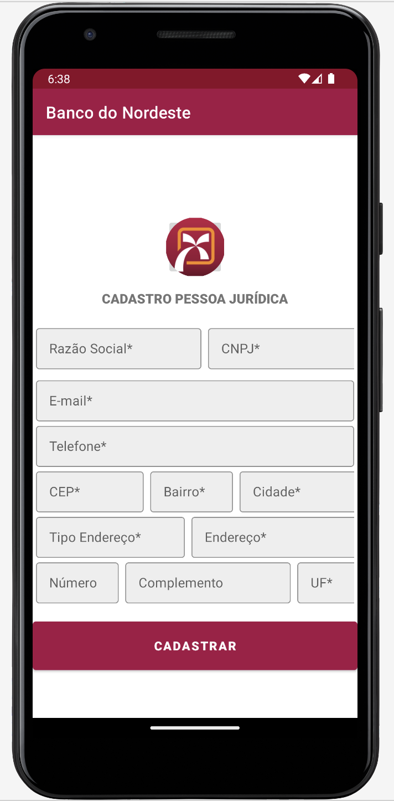

# CRUD-BNB APP

CRUD-BNB é um **aplicativo Android** focado em **criar registros de usuários e empresas do Banco do Nordeste**.

O aplicativo permite que você **crie e liste registros de 2 tipos de usuários:**
* Pessoa Física;
* Pessoa Jurídica.

## Objetivo 

Criar registros de usuários e empresas do Banco do Nordeste.

### Tecnologias & Tools

* Android;
* Java;
* Arquitetura MVC;
* Material Design;
* Constraintlayout;
* Firebase (banco de dados na nuvem);
* Gradle.

### Status: Concluído

## Telas

  
  
  
 

<!-- Android App that's allow you to compare 2 list of strings and return the common strings between them -->

